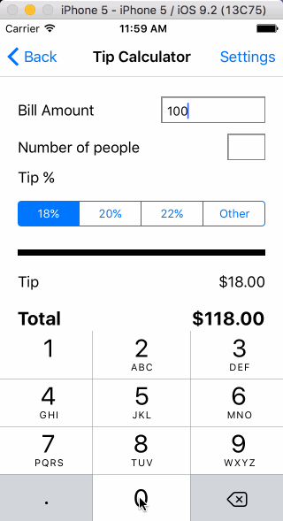

This is a Tip Calculator application for iOS submitted as the pre-assignment requirement for CodePath.

Time spent: [10 hrs]

Completed:
* Required: User can enter a bill amount, choose a tip percentage, and see the tip and total values.
* Required: Settings page to change the default tip percentage.
* Optional: Remembering the bill amount across app restarts (if <10mins)
* Optional: Making sure the keyboard is always visible and the bill amount is always the first responder. This way the user  doesn't have to tap anywhere to use this app. Just launch the app and start typing.
 
Comments: 
* Added a suggested tip amount (based on service) screen and the option in the settings screen to turn this feature on or off
* Added the option to enter the number of people to share the tip
* Added a control to choose custom tip value - apart from predefined values of 18, 20 and 22 percent.
* Added dark theme in settings to switch color theme 
* Added suggested tip percent(based on service) to settings page

Enhanced Video Walkthrough :

Video Walkthrough:

